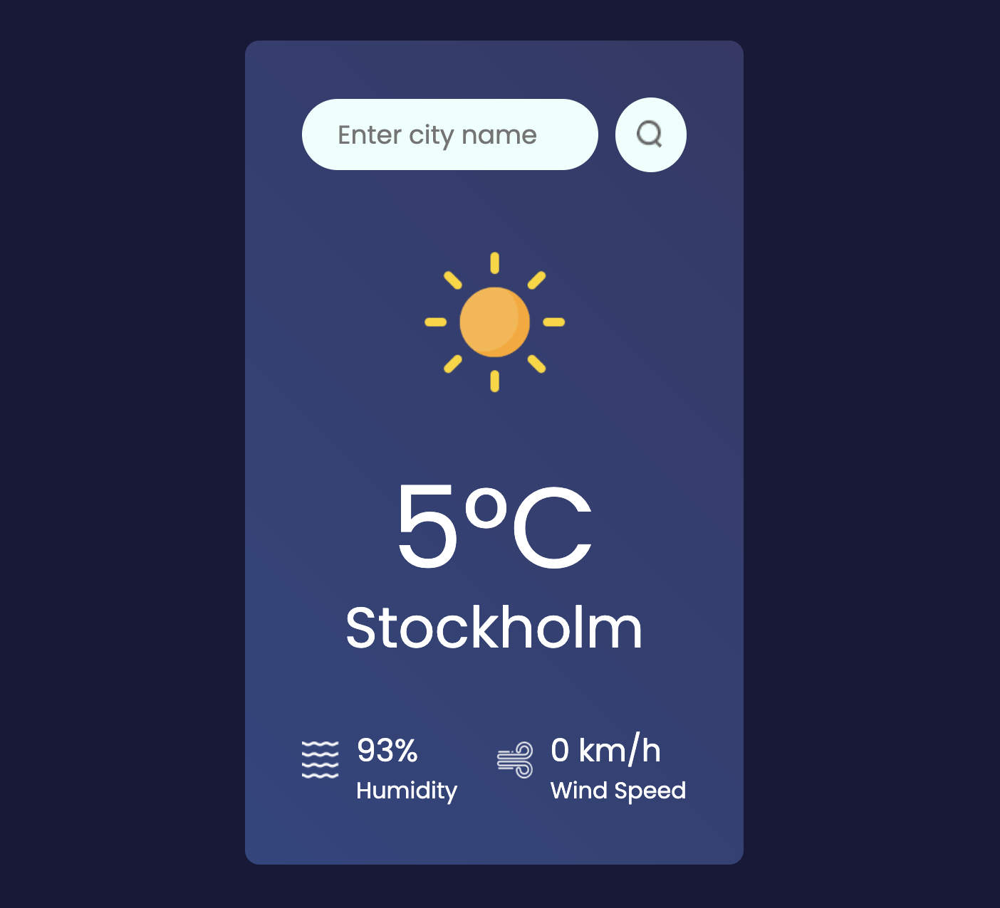

# Weather App

A modern, responsive weather application built with React and Vite that provides real-time weather information for any city worldwide.

## Demo

Try the live demo: 

## Features

- Real-time weather data from OpenWeatherMap API
- Search for any city globally
- Shows temperature, humidity, and wind speed
- Dynamic weather icons based on current conditions
- Fully responsive design
- Fast development experience with Vite

## Tech Stack

- Frontend: React 19
- Build Tool: Vite 7
- Styling: CSS
- API: OpenWeatherMap
- Linting: ESLint

## Getting Started

### Prerequisites
- Node.js 18+ (recommended)
- npm or yarn
- OpenWeatherMap API key

### Getting an API Key
1. Go to https://openweathermap.org/api
2. Create a free account and log in
3. Generate an API key in your dashboard
4. Paste it into your `.env` as `VITE_API_KEY`

## Usage
- The app loads Stockholm weather by default
- Type a city name into the search field
- Click the search icon to fetch the current weather
- The UI shows temperature (°C), humidity (%), and wind speed

## Notes
- This project uses Vite environment variables; ensure your key is defined as `VITE_API_KEY` in a `.env` file.
- Weather icons are mapped from OpenWeatherMap condition codes to local assets.

## Troubleshooting
- If you see an error like "Please enter a city name", make sure you typed a non-empty city.
- If requests fail, confirm your API key is valid and correctly set in `.env`.

## License
This project is open source under the MIT License.
